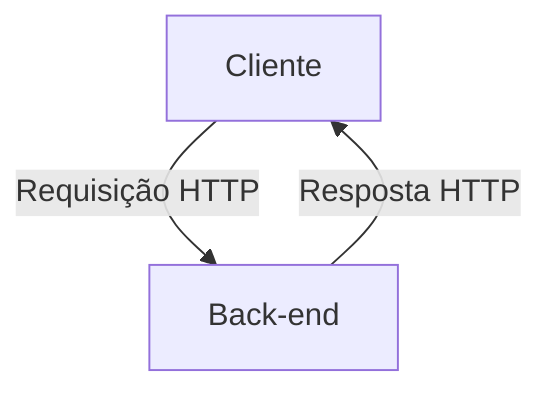

# API de Cursos

Este repositório foi feito para abrigar a atividade prática do professor Fernando, que consiste em fazer
uma API de cursos completa, evoluindo o mesmo projeto conforme demonstrado nas aulas.

## Fluxo cliente e servidor

Quando um cliente consulta `/GET cursos`, o caminho a seguir é executado:

1. **Cliente faz a requisição:**
   * O **Cliente** envia uma requisição HTTP GET para a rota `/cursos` do servidor.
   * **O que o cliente solicita:** A lista de todos os cursos disponíveis cadastrados no sistema.

2. **Processamento no Back-end:**
   * O **Servidor** (Back-end) recebe e interpreta a requisição.
   * Valida a rota e o método HTTP (`GET`).
   * Consulta a base de dados para obter as informações dos cursos.

3. **Servidor envia a resposta:**
   * O Servidor constrói uma resposta HTTP contendo:
      * **Código de Status HTTP:** `200 OK` (indicando sucesso).
      * **Corpo da Resposta (Payload):** Uma estrutura de dados (geralmente em formato JSON) contendo os dados dos cursos.
   * **O que o servidor devolve:** Uma coleção de objetos "curso" (ex.: id, título, descrição, carga horária).

4. **Cliente recebe a resposta:**
   * O Cliente recebe a resposta HTTP, processa o JSON retornado e exibe as informações dos cursos na interface para o usuário final.

## Responsabilidades do back-end

1. **Receber os dados enviados pelo cliente:** Captura os dados brutos trafegados no corpo da requisição HTTP (payload em formato JSON).
2. **Transformar os dados em um objeto Java:** Converte e desserializa a estrutura JSON recebida para um objeto DTO ou entidade em Java, permitindo sua manipulação em código.
3. **Verificar as regras do curso:** Aplica as validações e regras de negócio essenciais (ex.: checar campos obrigatórios, validar carga horária mínima, impedir títulos duplicados).
4. **Salvar o curso:** Transmite o objeto validado para a camada de persistência para ser gravado no banco de dados.
5. **Devolver uma resposta ao cliente:** Retorna uma resposta HTTP apropriada (ex.: código `201 Created` com o recurso gerado ou `400 Bad Request` em caso de erro de validação).

> **Diferencial de Processamento:** O back-end não atua como uma tela passiva; ele é responsável por interpretar protocolos, aplicar regras de negócio, assegurar a integridade dos dados antes da gravação e definir o status final da comunicação HTTP.

## Contrato inicial da API

Esta seção especifica o contrato da API para o gerenciamento de cursos. Qualquer cliente HTTP pode consumir a API utilizando os endpoints, métodos e formatos detalhados abaixo.

### Mapeamento dos Endpoints

| Operação | Método HTTP | URL | Descrição | Status HTTP de Sucesso |
| :--- | :--- | :--- | :--- | :--- |
| **Cadastrar curso** | `POST` | `/cursos` | Cria um novo curso com os dados enviados | `201 Created` |
| **Listar cursos** | `GET` | `/cursos` | Retorna a lista de todos os cursos | `200 OK` |
| **Buscar curso por ID** | `GET` | `/cursos/{id}` | Retorna os detalhes de um curso específico | `200 OK` |
| **Atualizar curso** | `PUT` | `/cursos/{id}` | Atualiza todos os dados de um curso existente | `200 OK` |
| **Excluir curso** | `DELETE` | `/cursos/{id}` | Remove um curso do sistema | `204 No Content` |